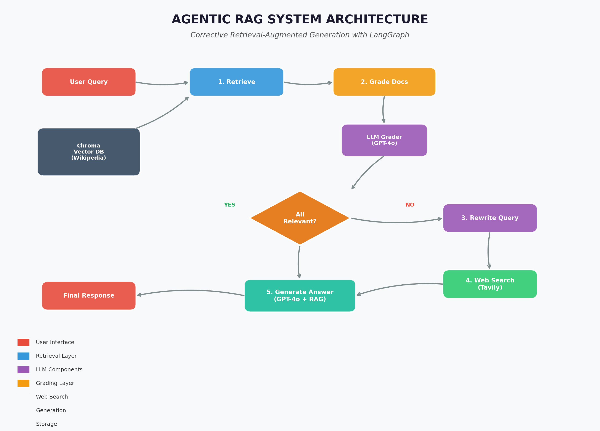
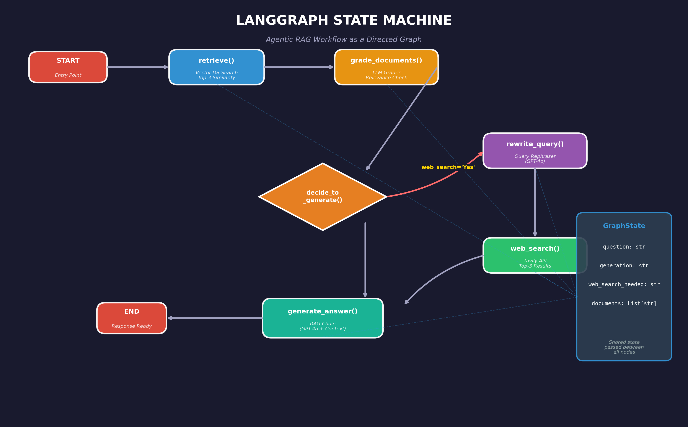
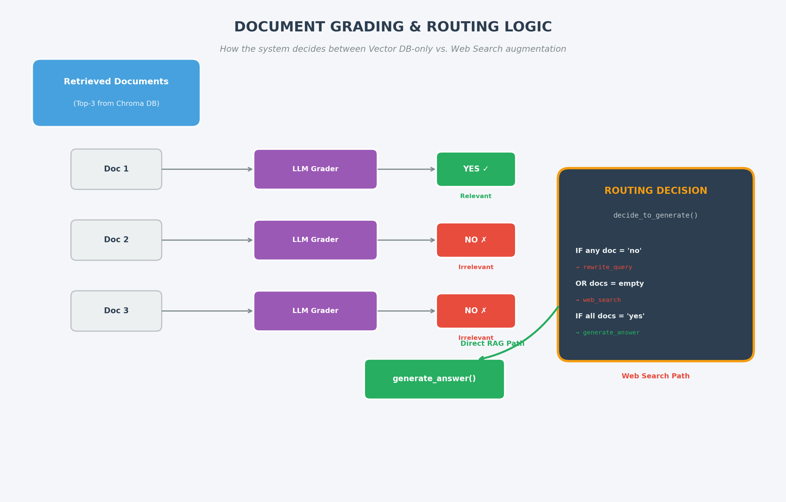
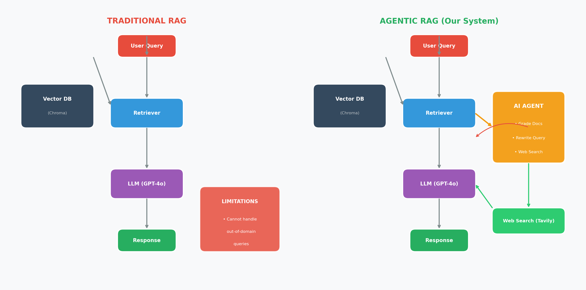
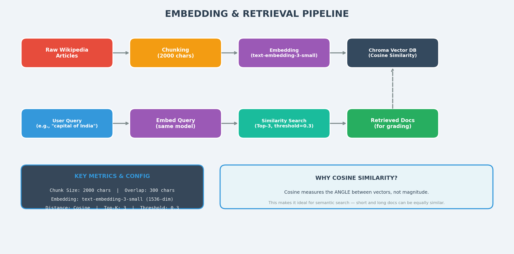

Here is a polished, professional README for your **agentic_rag** project.

---

# 🤖 Agentic RAG

An advanced, intelligent Retrieval-Augmented Generation (RAG) framework designed to perform multi-step reasoning, dynamic context retrieval, and precise query answering.

---

## 🌟 Features

* **Autonomous Agent Routing:** Dynamically decides whether to fetch external context, query vector databases, or compute directly based on user intent.
* **Smart Context Retrieval:** Filters and re-ranks retrieved chunks to eliminate noise and maximize response relevance.
* **Seamless API Integration:** Built to scale easily with modern LLM providers and custom vector databases.
* **Modular Architecture:** Cleanly separated core logic, search tools, and UI interfaces.

---

## 📸 Architecture & Screenshots

Below are the repository diagrams that explain the design and flow. They are included in the repository root — click to enlarge on GitHub.

### System architecture



### Langgraph / state machine



### Grading & decision logic



### Traditional vs Agentic comparison



### Embedding & retrieval pipeline



---

## 🚀 Quick Start

### 1. Clone the Repository

```bash
git clone https://github.com/meddadaek/agentic_rag.git
cd agentic_rag

```

### 2. Set Up Virtual Environment & Dependencies

```bash
python -m venv venv
source venv/bin/activate  # On Windows: venv\Scripts\activate
pip install -r requirements.txt

```

### 3. Environment Variables

Create a `.env` file in the root directory and add your credentials:

```env
OPENAI_API_KEY=your_openai_api_key
PINECONE_API_KEY=your_vector_db_key

```

### 4. Run the Application

```bash
python main.py

```

---

## 🛠️ Tech Stack

* **Language:** Python 3.10+
* **Frameworks:** LangChain / LlamaIndex
* **Vector Store:** Pinecone / FAISS / Qdrant
* **Embeddings & LLMs:** OpenAI / Hugging Face

---

## 🤝 Contributing

Contributions are welcome! Feel free to open an issue or submit a pull request:

1. Fork the Project
2. Create your Feature Branch (`git checkout -b feature/AwesomeFeature`)
3. Commit your Changes (`git commit -m 'Add some AwesomeFeature'`)
4. Push to the Branch (`git push origin feature/AwesomeFeature`)
5. Open a Pull Request

---

## 📜 License

Distributed under the MIT License. See `LICENSE` for more information.

---

### 💡 Note on Image Paths:

The five diagram files are included in the repository root. If you rename or move them, update the image paths above so they render correctly on GitHub.
